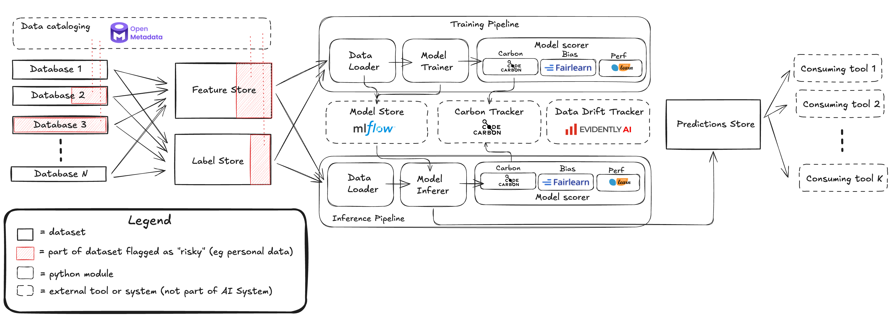

# Responsible AI Framework For Supervised ML

This repo implements a toy ML project running with a full
suite of data and MLOps tools to demonstrate how to build
responsible AI systems.

The system implemented in summarised by the following
architecture:

